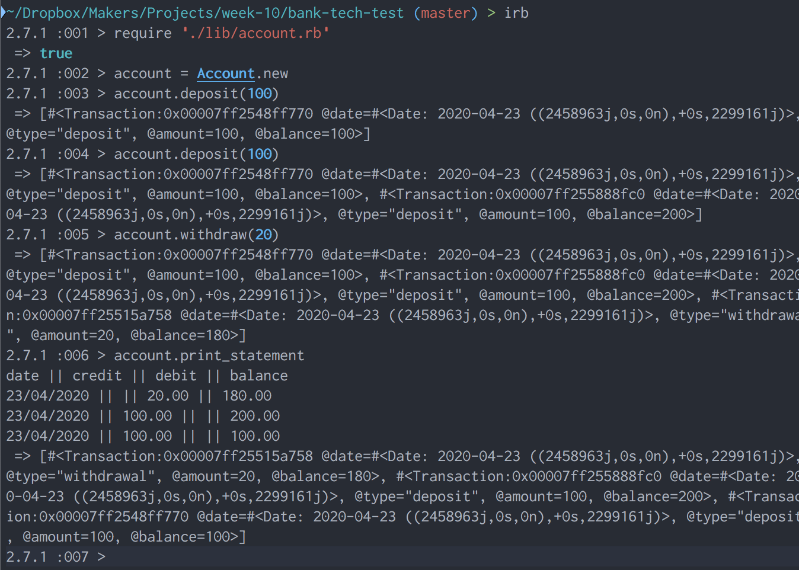

## Bank

### How to setup

- Install Ruby 2.7.1
- Clone the git repository
- Run bundle install

### How to run the application
- Run IRB shell from the lib folder of the project
> `> require './account.rb'`</br>
> `> account = Account.new`

- Interact with the account through either deposit, withdraw or print_statement methods. e.g.</br>
>`> account.deposit(100)`</br>
`> account.withdraw(20)`</br>
`> account.print_statement`

### Screenshot of working application




### How to run the tests
- Navigate to the root folder of the project
- Run rspec

### Acceptance criteria

**Given** a client makes a deposit of 1000 on 10-01-2012  
**And** a deposit of 2000 on 13-01-2012  
**And** a withdrawal of 500 on 14-01-2012  
**When** she prints her bank statement  
**Then** she would see

```
date || credit || debit || balance
14/01/2012 || || 500.00 || 2500.00
13/01/2012 || 2000.00 || || 3000.00
10/01/2012 || 1000.00 || || 1000.00
```
